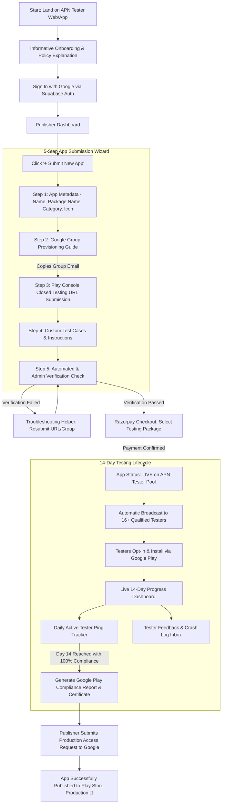

# Publisher (Uploader) User Journey & Experience Architecture

This document defines the complete end-to-end experience for Android developers and app publishers using the **APN Tester** platform across Web and Mobile.

---

## 1. User Persona

- **Name**: Priya Sharma
- **Role**: Indie Android Developer & Startup Founder
- **Problem**: Finished building an innovative productivity app. Submitted to Google Play Console, but blocked by Google's requirement: *Must have at least 14 testers opted-in to closed testing continuously for at least 14 days before applying for production access*. Friends and family download it on Day 1 but uninstall or stop opening it by Day 4, risking Google rejection.
- **Needs**: Guaranteed 14+ genuine, active testers who will keep the app installed for 14 continuous days, generate daily usage sessions, and provide structured feedback.

---

## 2. End-to-End Flow Diagram

---

## 3. Step-by-Step Experience Breakdown

### Step 1: Informative Onboarding
- Explains Google's 14-tester / 14-day policy with clear infographics.
- Interactive timeline showing how APN Tester automates recruitment, daily pings, and compliance logging.

### Step 2: Google Group Provisioning Assistant
- Clear 3-step illustrated walkthrough on how to configure Google Play Console:
  1. Open Google Play Console > *Testing* > *Closed testing*.
  2. Select *Testers* tab > Click *Google Groups*.
  3. Paste `testers-group@apntester.com` and save changes.
- Copy button with instant haptic/toast confirmation.

### Step 3: URL & Test Case Input
- Web testing join link (`https://play.google.com/apps/testing/<package_name>`)
- Android opt-in join link (`https://play.google.com/store/apps/details?id=<package_name>`)
- Test credentials (if app requires demo login).
- Specific flows to test (e.g. Onboarding flow, in-app purchase sandbox, offline sync).

### Step 4: Verification Stage
- Automated crawler and admin verification checks:
  - Is the package ID active on Google Play Closed track?
  - Does the APN Google Group have active access permissions?
  - Are minimum Android SDK requirements matched?
- Estimated time: 5-15 minutes with real-time status updates and SMS/Email/Push notification upon approval.

### Step 5: Razorpay Payment & Live Launch
- Razorpay Payment Gateway integration:
  - Accepts UPI (GPay, PhonePe, Paytm), NetBanking, Credit/Debit Cards, EMI.
  - Transparent pricing with zero hidden fees.
  - Generates instant tax invoice and order receipt.
- Once payment clears, the app transitions immediately to the `live_applications` table in Supabase.

### Step 6: 14-Day Real-Time Live Monitor
- Day-by-day interactive calendar (Day 1 to 14).
- Active tester roster (14 required + 2 safety reserves = 16 testers).
- Daily open-rate heartbeat graph showing daily sessions.
- In-app feedback and bug report feed.
- Downloadable compliance report formatted specifically to answer Google Play Console's production access questionnaire ("What feedback did you receive during closed testing?").
