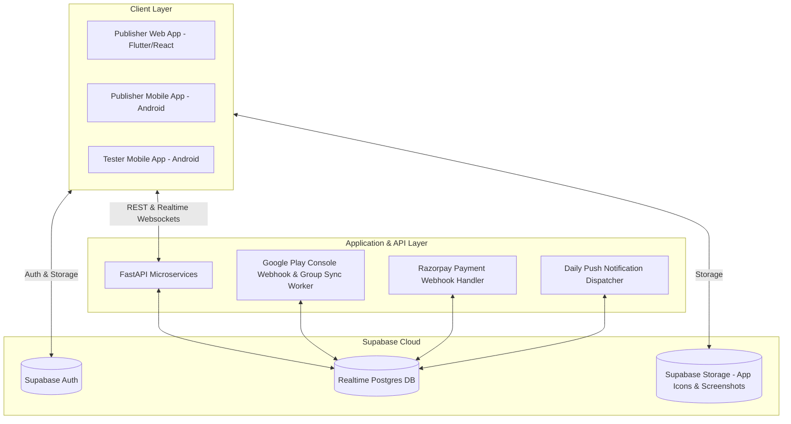

# System Architecture, Database Schema & Integration Flows

This document details the backend architecture, Supabase schema, FastAPI endpoints, and payment flow specifications supporting the APN Tester UI/UX workflows.

---

## 1. System Architecture Overview



---

## 2. Database Schema (Supabase Realtime Tables)

### Table 1: `users`
```sql
CREATE TABLE users (
    id UUID PRIMARY KEY DEFAULT gen_random_uuid(),
    email TEXT UNIQUE NOT NULL,
    full_name TEXT,
    avatar_url TEXT,
    role TEXT CHECK (role IN ('publisher', 'tester', 'admin')) DEFAULT 'publisher',
    google_group_joined BOOLEAN DEFAULT FALSE,
    reward_points INTEGER DEFAULT 0,
    created_at TIMESTAMPTZ DEFAULT NOW(),
    updated_at TIMESTAMPTZ DEFAULT NOW()
);
```

### Table 2: `applications_under_process` (Verification Queue)
```sql
CREATE TABLE applications_under_process (
    id UUID PRIMARY KEY DEFAULT gen_random_uuid(),
    user_id UUID REFERENCES users(id) ON DELETE CASCADE,
    app_name TEXT NOT NULL,
    package_name TEXT NOT NULL UNIQUE,
    category TEXT,
    icon_url TEXT,
    play_store_web_url TEXT NOT NULL,
    play_store_android_url TEXT NOT NULL,
    test_instructions TEXT,
    verification_status TEXT CHECK (verification_status IN ('pending', 'verifying', 'approved', 'rejected')) DEFAULT 'pending',
    verification_notes TEXT,
    submitted_at TIMESTAMPTZ DEFAULT NOW()
);
```

### Table 3: `live_applications` (Active 14-Day Testing)
```sql
CREATE TABLE live_applications (
    id UUID PRIMARY KEY DEFAULT gen_random_uuid(),
    app_process_id UUID REFERENCES applications_under_process(id),
    user_id UUID REFERENCES users(id) ON DELETE CASCADE,
    app_name TEXT NOT NULL,
    package_name TEXT NOT NULL,
    icon_url TEXT,
    date_published TIMESTAMPTZ DEFAULT NOW(),
    last_date_testing TIMESTAMPTZ NOT NULL,
    target_days INTEGER DEFAULT 14,
    current_day INTEGER DEFAULT 1,
    required_testers INTEGER DEFAULT 14,
    active_testers_count INTEGER DEFAULT 0,
    status TEXT CHECK (status IN ('active', 'completed', 'paused', 'cancelled')) DEFAULT 'active',
    payment_id TEXT,
    created_at TIMESTAMPTZ DEFAULT NOW()
);
```

### Table 4: `payments` (Razorpay Transactions)
```sql
CREATE TABLE payments (
    id UUID PRIMARY KEY DEFAULT gen_random_uuid(),
    user_id UUID REFERENCES users(id) ON DELETE CASCADE,
    app_id UUID REFERENCES applications_under_process(id),
    razorpay_order_id TEXT UNIQUE NOT NULL,
    razorpay_payment_id TEXT,
    razorpay_signature TEXT,
    amount NUMERIC(10, 2) NOT NULL,
    currency TEXT DEFAULT 'INR',
    status TEXT CHECK (status IN ('created', 'authorized', 'captured', 'failed')) DEFAULT 'created',
    created_at TIMESTAMPTZ DEFAULT NOW()
);
```

### Table 5: `daily_test_logs` (Tester Heartbeat & Streaks)
```sql
CREATE TABLE daily_test_logs (
    id UUID PRIMARY KEY DEFAULT gen_random_uuid(),
    live_app_id UUID REFERENCES live_applications(id) ON DELETE CASCADE,
    tester_id UUID REFERENCES users(id) ON DELETE CASCADE,
    test_date DATE DEFAULT CURRENT_DATE,
    duration_seconds INTEGER DEFAULT 0,
    verified BOOLEAN DEFAULT FALSE,
    feedback_submitted BOOLEAN DEFAULT FALSE,
    feedback_text TEXT,
    rating INTEGER CHECK (rating BETWEEN 1 AND 5),
    created_at TIMESTAMPTZ DEFAULT NOW(),
    UNIQUE(live_app_id, tester_id, test_date)
);
```

---

## 3. Razorpay Payment Lifecycle

1. **Order Creation**: Publisher clicks *Proceed to Payment* -> Client calls FastAPI `/api/v1/payments/create-order` -> FastAPI requests Razorpay API -> Returns `order_id`.
2. **Checkout UI**: Client launches Razorpay Standard Checkout modal with brand colors and order details.
3. **Payment Completion & Webhook**:
   - Razorpay signs payment payload and returns `razorpay_payment_id` and `razorpay_signature`.
   - FastAPI `/api/v1/payments/verify` validates SHA256 HMAC signature.
   - On success: Record inserted into `payments`, app promoted from `applications_under_process` to `live_applications`.
   - Automated notification dispatched to tester group.
