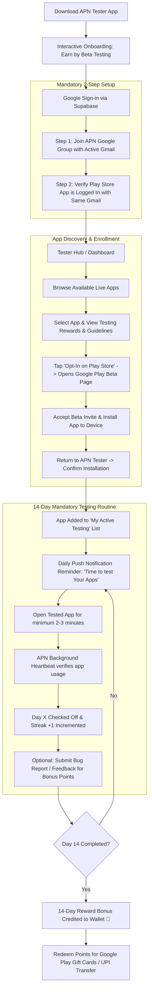

# Tester User Journey & Experience Architecture

This document defines the tester-side experience for the **APN Tester** Android and Web application.

---

## 1. User Persona

- **Name**: Alex Rivera
- **Role**: Tech Enthusiast, Beta Tester & Student
- **Motivation**: Enjoys discovering early-stage apps before public release, earning points redeemable for Google Play credits / gift cards, and helping indie creators build better software.
- **Key Behavior**: Uses Android phone daily, opens APN Tester app for 3-5 minutes every morning to complete daily app testing tasks.

---

## 2. Tester Lifecycle Flowchart

---

## 3. Key Tester Experience Features

### 1. Zero-Confusion Account Matching
- Because Google Play closed testing strictly grants access to the specific Gmail address enrolled in the Google Group, the APN Tester onboarding explicitly highlights the active email:
  - *"You are logged in as `alex.rivera@gmail.com`. Please ensure your Google Play Store app is active with this exact account."*

### 2. Daily Testing Checklist & Timer
- Clear visual checklist of enrolled apps.
- Progress bar for the day: e.g. `3 of 4 apps tested today`.
- One-tap launcher button: Directly launches the tested app from within APN Tester.
- Daily usage validator: Detects app foreground activity and awards daily streak credit.

### 3. Feedback & Bug Reporter
- Built-in form allowing testers to report:
  - Device info (auto-filled: OS Version, Device Model, RAM).
  - Bug description, reproduction steps.
  - Screenshot attachment.
- Publishers receive this feedback in real-time.

### 4. Rewards & Gamification
- Points system:
  - Daily open: +50 points
  - 14-day completion streak bonus: +500 points
  - Quality bug report: +150 points
- Wallet screen with instant redemption for gift cards and direct payouts.
